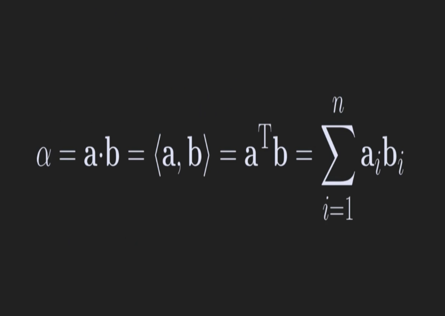
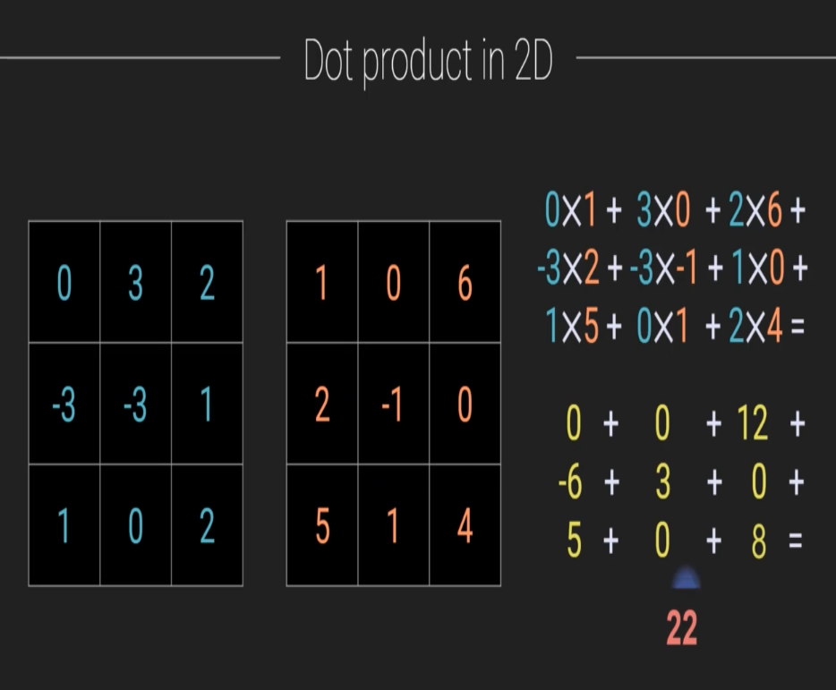
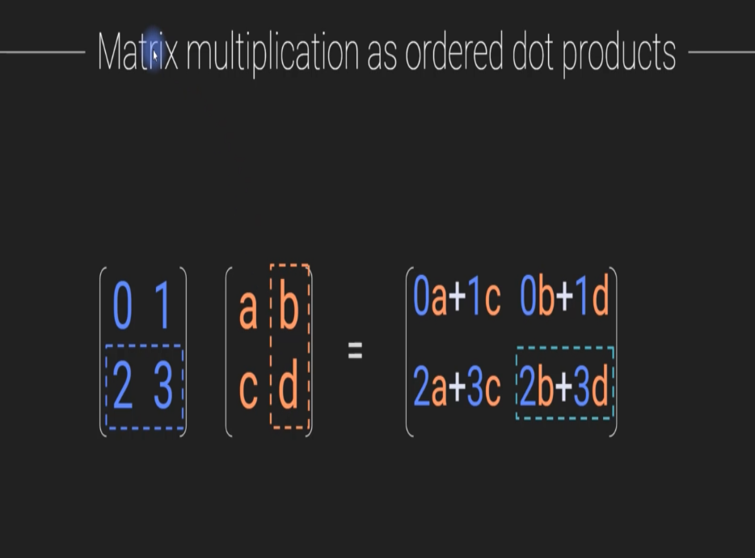

### Overviews:
All about AI/ML Related Math Concepts.

### Spectral Theories in Math:
The idea of Spectral Theories in Math is => Breaking down a complected system (decomposing) into individual simple component. Like understanding something `Complected` by breaking it into simple part.

Example in ML is Deep Neural Network: Where as a whole it's a complicated, but inside it is composed of many simple component.

### Data Types:
Scalar : Single Integer
Vector : 1 Dimensional Array, 1 column vector or 1 row vector
Matrix : 2 Dimensional Array. Like GrayScale Images stored in Computer with Only light intensity values.
Tensor : More than 2 Dimensional Array (also can be called 3 or more dimensional Matrix), Example Color Images with RGB channel.
### Conversion of reality to numbers:
Two types of Reality
1. Continuous (Numeric): height, exam scores, income etc
2. Categorical (Discrete/Distinct/Separate) : Picture identity (cat or dog), disease diagnosis

Categorical Data to Numeric Conversion:
1. Dummy-coding : 0 or 1 (true/false), a vector of boolean. Example : exam (pass/fail), fraud detection
2. One-hot-encoding : 0 or 1 per Category, Matrix based. It's Dummy-coding with 3 or more category. Example : image recognition, hand-written letter recognition.

Ex: `One-hot-encoding`

```python
y = [ [0,1,0],
      [0,0,1], 
      [1,0,0] ]
```

| Genre | History | SciFi | Kids |
| ----- | ------- | ----- | ---- |
| y1 | 0 | 1 | 0 |
| y2 | 0 | 0 | 1 |
| y3 | 1 | 0 | 0 |

### Matrix Transpose (Col <=> Row):
It's the conversion of Column into Row and vise-versa. Expressed with `T`. Double Transpose will give same Matrix.

y = [[1,2],[3,4]]
y-transposed = [[1,3],[2,4]]
```py
import numpy as np 
import pandas as pd
import matplotlib.pyplot as plt
import torch

# Create a numpy matrix
nm = np.array([[1,2],[3,4]])
print(nm) # [[1,2], [3,4]]

# transpose nv
print(nm.T) # [[1,2], [2,4]]

# Also with np-array.transpose()
nm.transpose() # [[1,2], [2,4]]

# Transposing with Torch
tm = torch.tensor([ [[1,2],[3,4]] ])
print(tm.mT) # tensor([ [[1, 3], [2, 4]] ])
print(tm.mT.mT) # Double Transpose returns the original matrix
print(tm.T) # Deprecated, it will also change the original matrix to the Transposed version
```
### Dot Product of Vectors/Matrices:
It's the element-wise multiplication and sum between two vector/matrices that return a single number.

Interpretation of Dot Product : A single number that reflects the commonalities between two mathematical objects (vectors, matrices, tensors, signals, images)

Expressed by `alpha`/a.b/a Transpose b/{a,b} and by `Summation of n elements of an*bn`


Example:
Dot Product Between [1,2] and [3,4] is `1*3 + 2*4 = 11`

* 2 vector need to be on same shape
* Dot product between 2 vectors/matrices is always a single number


```py
nv1 = np.array([1,2])
nv2 = np.array([3,4])

print(np.dot(nv1,nv2)) # 11
print(np.sum(nv1 * nv2)) # manual math

# Using Pytorch
tv1 = torch.tensor([1,2])
tv2 = torch.tensor([3,4])

print(torch.dot(tv1, tv2)) # tensor(11)
print(torch.sum(tv1 * tv2)) # manual math
```
### Dot Product Uses:
Statistics - Correlation-Coefficient, least-squares, entropy, PCA (Principal component analysis)
Signal processing - Fourier transform, filtering
Science - Geometry, Physics, Mechanics
Linear algebra - Projection, transformation, multiplication
Deep learning - Convolution, Matrix Multiplication, Gram matrix (used in style transfer)
### Matrix Multiplication:
It's a fancy application of a dot product with series of Dot Product Operations. It happens between 2 Matrices

Rules:
1. Inner Shape needs to be same to be eligible for multiplication. `Shape(2,3)` and `Shape(3,7)` will work as `3` are matching
2. outer Shape will be the output of multiplication

Example:
matrix = M Rows x N Columns || `MR NiCi Guy`
multiplication = MxN NxK = MxK || where N and N must match in shape and MxK is the output

And each output cell/matrix-item is a dot product between Col(T) and Row.
 

Using `Numpy` For Matrix Multiplication
```python
# Create some random matrics
A = np.random.randn(3,4)
B = np.random.randn(4,5)
C = np.random.randn(3,7)

# Try multiplication
print(np.matmul(A,B)) # Matrix Multiplication using `np.matmul`
print(A@B) # using `@`

# A@B will not work as it vioaltes the rules

# Between A & C we can Transpose either one to meke it eligible for multiplication
# to match the inner dimensions' shape
print(A.T@C) # Transposing A First, then commiting multiplication
```

Using `Pytorch`
```python
# create some pytorch random matrices
tA = torch.randn(3,4)
tB = torch.randn(4,5)
# togather with numpy and torch
C1 = np.random.randn(4,7)
tC2 = torch.tensor(C1, dtype=torch.float)

# try multiplication
print(torch.matmul(tA,tB)) # with matmul
print(tA@tB) # with @

# with torch and numpy
print(tA@C1) # success with `@` for multiplication
# print(torch.matmul(tA, C1)) # using `matmul` will throw error as C1 is not a tensor
print(torch.matmul(tA, tC2)) # success as both are tensor

print(tB.T@tC2) # making multiplication eligible by Transposing tB to match innder dimensions's shape
```
### SoftMax:
SoftMax function is expressed using `lower case sigma`. The return value of SoftMax function is always will be from 0 to 1, and sum of all value will be 1. For this special property of being between 0 and 1, it is used for probability calculation in ML.

Note : e = 2.718.... as `Natural Exponent` or `Euler's number/scalar`. This a never ending number without any ending pattern