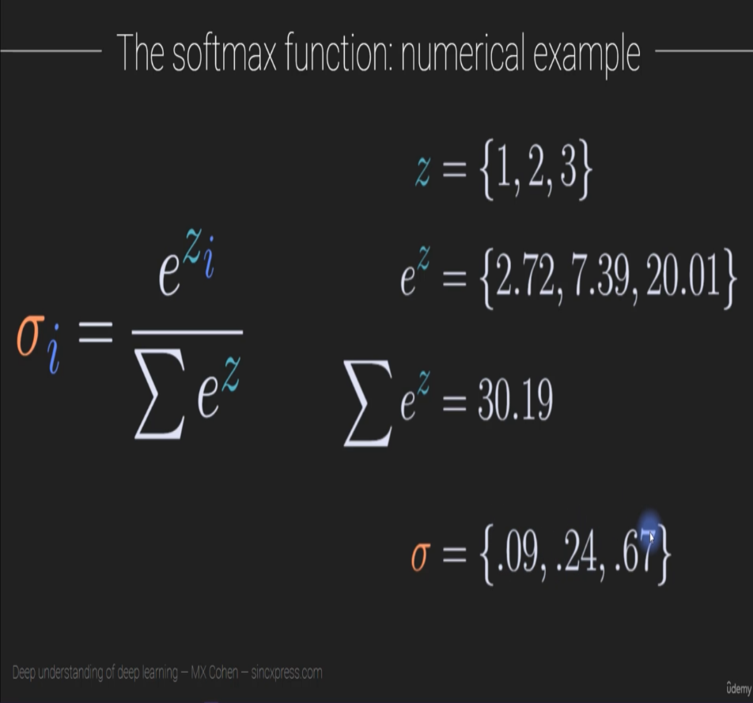
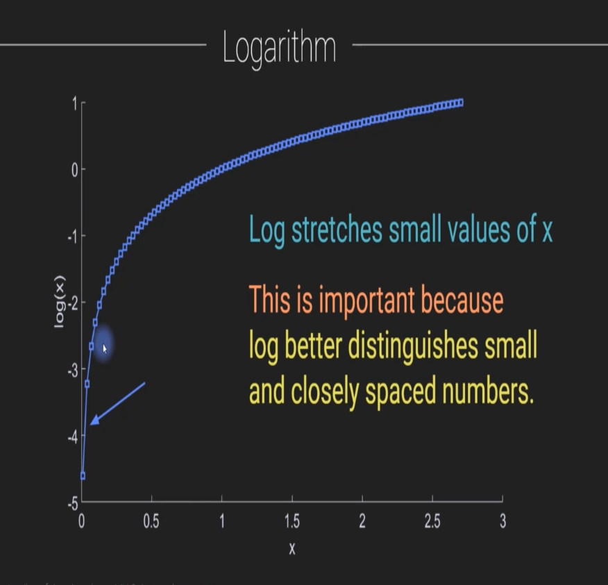
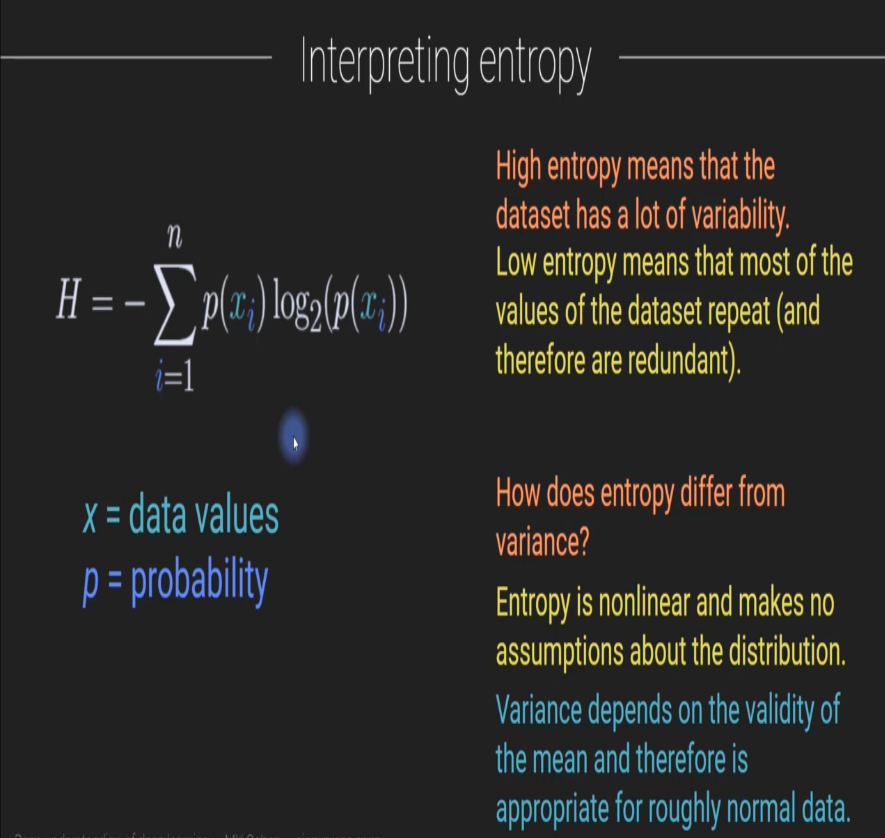
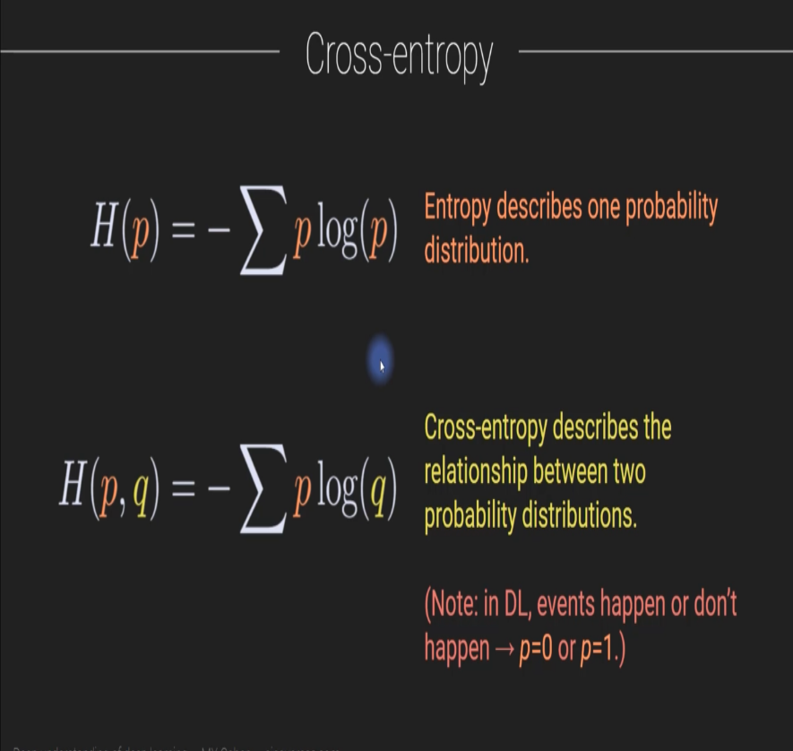

### Overviews:
All about AI/ML Related Math Concepts.

### Imports for Jupyter Notebook:
```python
import numpy as np 
import pandas as pd
import matplotlib.pyplot as plt
import torch
import torch.nn as nn
import matplotlib.pyplot as plt
```

### Spectral Theories in Math:
The idea of Spectral Theories in Math is => Breaking down a complected system (decomposing) into individual simple component. Like understanding something `Complected` by breaking it into simple part.

Example in ML is Deep Neural Network: Where as a whole it's a complicated, but inside it is composed of many simple component.

### Data Types:
Scalar : Single Integer
Vector : 1 Dimensional Array, 1 column vector or 1 row vector
Matrix : 2 Dimensional Array. Like GrayScale Images stored in Computer with Only light intensity values.
Tensor : More than 2 Dimensional Array (also can be called 3 or more dimensional Matrix), Example Color Images with RGB channel.
### Conversion of reality to numbers:
Two types of Reality
1. Continuous (Numeric): height, exam scores, income etc
2. Categorical (Discrete/Distinct/Separate) : Picture identity (cat or dog), disease diagnosis

Categorical Data to Numeric Conversion:
1. Dummy-coding : 0 or 1 (true/false), a vector of boolean. Example : exam (pass/fail), fraud detection
2. One-hot-encoding : 0 or 1 per Category, Matrix based. It's Dummy-coding with 3 or more category. Example : image recognition, hand-written letter recognition.

Ex: `One-hot-encoding`

```python
y = [ [0,1,0],
      [0,0,1], 
      [1,0,0] ]
```

| Genre | History | SciFi | Kids |
| ----- | ------- | ----- | ---- |
| y1 | 0 | 1 | 0 |
| y2 | 0 | 0 | 1 |
| y3 | 1 | 0 | 0 |

### Matrix Transpose (Col <=> Row):
It's the conversion of Column into Row and vise-versa. Expressed with `T`. Double Transpose will give same Matrix.

y = [[1,2],[3,4]]
y-transposed = [[1,3],[2,4]]
```py
import numpy as np 
import pandas as pd
import matplotlib.pyplot as plt
import torch

# Create a numpy matrix
nm = np.array([[1,2],[3,4]])
print(nm) # [[1,2], [3,4]]

# transpose nv
print(nm.T) # [[1,2], [2,4]]

# Also with np-array.transpose()
nm.transpose() # [[1,2], [2,4]]

# Transposing with Torch
tm = torch.tensor([ [[1,2],[3,4]] ])
print(tm.mT) # tensor([ [[1, 3], [2, 4]] ])
print(tm.mT.mT) # Double Transpose returns the original matrix
print(tm.T) # Deprecated, it will also change the original matrix to the Transposed version
```
### Dot Product of Vectors/Matrices:
It's the element-wise multiplication and sum between two vector/matrices that return a single number.

Interpretation of Dot Product : A single number that reflects the commonalities between two mathematical objects (vectors, matrices, tensors, signals, images)

Expressed by `alpha`/a.b/a Transpose b/{a,b} and by `Summation of n elements of an*bn`


Example:
Dot Product Between [1,2] and [3,4] is `1*3 + 2*4 = 11`

* 2 vector need to be on same shape
* Dot product between 2 vectors/matrices is always a single number


```py
nv1 = np.array([1,2])
nv2 = np.array([3,4])

print(np.dot(nv1,nv2)) # 11
print(np.sum(nv1 * nv2)) # manual math

# Using Pytorch
tv1 = torch.tensor([1,2])
tv2 = torch.tensor([3,4])

print(torch.dot(tv1, tv2)) # tensor(11)
print(torch.sum(tv1 * tv2)) # manual math
```
### Dot Product Uses:
Statistics - Correlation-Coefficient, least-squares, entropy, PCA (Principal component analysis)
Signal processing - Fourier transform, filtering
Science - Geometry, Physics, Mechanics
Linear algebra - Projection, transformation, multiplication
Deep learning - Convolution, Matrix Multiplication, Gram matrix (used in style transfer)
### Matrix Multiplication:
It's a fancy application of a dot product with series of Dot Product Operations. It happens between 2 Matrices

Rules:
1. Inner Shape needs to be same to be eligible for multiplication. `Shape(2,3)` and `Shape(3,7)` will work as `3` are matching
2. outer Shape will be the output of multiplication

Example:
matrix = M Rows x N Columns || `MR NiCi Guy`
multiplication = MxN NxK = MxK || where N and N must match in shape and MxK is the output

And each output cell/matrix-item is a dot product between Col(T) and Row.
 

Using `Numpy` For Matrix Multiplication
```python
# Create some random matrics
A = np.random.randn(3,4)
B = np.random.randn(4,5)
C = np.random.randn(3,7)

# Try multiplication
print(np.matmul(A,B)) # Matrix Multiplication using `np.matmul`
print(A@B) # using `@`

# A@B will not work as it vioaltes the rules

# Between A & C we can Transpose either one to meke it eligible for multiplication
# to match the inner dimensions' shape
print(A.T@C) # Transposing A First, then commiting multiplication
```

Using `Pytorch`
```python
# create some pytorch random matrices
tA = torch.randn(3,4)
tB = torch.randn(4,5)
# togather with numpy and torch
C1 = np.random.randn(4,7)
tC2 = torch.tensor(C1, dtype=torch.float)

# try multiplication
print(torch.matmul(tA,tB)) # with matmul
print(tA@tB) # with @

# with torch and numpy
print(tA@C1) # success with `@` for multiplication
# print(torch.matmul(tA, C1)) # using `matmul` will throw error as C1 is not a tensor
print(torch.matmul(tA, tC2)) # success as both are tensor

print(tB.T@tC2) # making multiplication eligible by Transposing tB to match innder dimensions's shape
```
### SoftMax:
SoftMax function is expressed using `lower case sigma`. The return value of SoftMax function is always will be from 0 to 1, and sum of all value will be 1. For this special property of being between 0 and 1, it is used for probability calculation in ML.

Note : e = 2.718.... as `Natural Exponent` or `Euler's number/scalar`. This a never ending number without any ending pattern

* SoftMax of [1,2,3] is `sigma` = (e^1 , e^2 , e^3) / (e^1 + e^2 + e^3)
Note: the denominator is the summation of e^n

Calculation: Normally if some collection of non-negative numbers are divided each by all of the collection's sum, the result of each division will be between 0 and 1 and summation of all results will be 1. SoftMax function will work like this way but to deal with negative numbers, it requires each of all numbers to be the exponent of `e` as euler number (as it will make any number a positive integer) and then proceed.  



Manual SoftMax Calculation in Python
```python
# Manual SoftMax in Numpy
z = [1,2,3]
num = np.exp(z)
den = np.sum(num) # denominator will be the sum of all elements (e^1 + e^2 + e^3)
sigma = num / den
print(sigma) # outputs [0.09003057 0.24472847 0.66524096]
print(np.sum(sigma)) # outputs 1.0
```

Plotting a SoftMax's Output
```python
# Plot of SoftMax
z = np.random.randint(-5, high=15, size=25)
print(z) # [ 0,  7,  9,  5,  1, -5,  8, 13,  1, -4, 13,  8, -3,  9,  7, -3,  6, 3,  8, -4, -3, 13,  3,  2,  2]

# computing softmax
num = np.exp(z)
den = np.sum(num)
sigma = num / den

# compare
plt.plot(z, sigma, 'ko')
plt.xlabel('Original number (z)')
plt.ylabel('Softmaxified $\sigma$')
# plt.yscale('log') # using logarithmic scale
plt.title('$\sum\sigma$ = %g' %np.sum(sigma))
plt.show();
```

SoftMax Calculation Using `Pytorch`
```python
# SoftMax using pytorch
z = np.random.randint(-5, high=15, size=25)
# convert numpy array to torch's Tensor
tz = torch.Tensor(z)
print(tz) # tensor([ 2., 13.,  8.,  0., 14., 13.,  5., -2.,  5.,  7., -5., -5.,  7.,  4., -4.,  3., 12., 10.,  1., -4.,  8., 14.,  9.,  5., 12.])

# create an instance of softmax activation class
softfun = nn.Softmax(dim=0)

# then apply the tersor data to the function
sigmaT = softfun(tz)
print(sigmaT) # tensor([1.2954e-04, 3.8614e-01, 8.7281e-07, ...])
print(torch.sum(sigmaT)) # tensor(1.)
```

### Logarithm (inverse of exponent or find the exponent):
The base of log is usually natural log (e), base 2 or base 10. But for ML `e` is mostly used.

When plotted in graph, log has some spacial property. Like on Log Space, the scale stretches more for small/starting value change than middle or ending value. Where in linear scale are will be equally spaced. 

That's why in log-space, it distinguishes small and closely spaced number. Which is helpful for optimizing probability/loss in ML as those are very small (close to zero) numbers. 


Minimizing the log is computationally easier than minimizing original probability values. As calculation operations on small decimal precision are expensive computational operation.

Logarithm in python and plotting
```python
# define a set of points to evaluate
x = np.linspace(.0001, 1, 200)
# print(x) # array([1.00000000e-04, 5.12462312e-03, 1.01492462e-02, 1.51738693e-02, ... 194 more])

# compute it's log
logx = np.log(x)

# plotting
fig = plt.figure(figsize=(10,6))

# increase font size
plt.rcParams.update({'font.size':15})

plt.plot(x, logx, 'ks-', markerfacecolor='w')
plt.xlabel('x')
plt.ylabel('log(x)')
plt.show();
```

Logarithm and Exponent with plotting
```python
# Demontration of log and exp are inverses
x = np.linspace(.0001,1,20) # only 20 values for now

# get log and exponent of x
logx = np.log(x)
expx = np.exp(x)

# Plotting
plt.plot(x,x,color=[.8,.8,.8])
plt.plot(x, np.exp(logx), 'o', markersize=8)
plt.plot(x, np.log(expx), 'x', markersize=8)
plt.xlabel('x')
plt.ylabel('f(g(x))')
plt.legend(['unity', 'exp(log(x))', 'log(exp(x))'])
plt.show();
```

### Entropy and Cross Entropy:
Different meaning in different fields
- Physics : It's the 2 law of Thermodynamics. It states, the universe (or matter) will turn into disorder from order (Unless it is 0 Kelvin of temperature by 3rd law) 

- Information-Theory / Statistics [Shannon's Entropy] : it is a measure of uncertainty (or variability) associated with random variables. The entropy is maximum when probability is .5, where things are unpredictable. The entropy decrease toward probability 0 and 1 from than .5 (middle). 



`Entropy` is used to describe one probability distribution. It is expressed by `H`. `H = - n/sum/i=1 ( p(x1) * log2(p(x1)) )` NB, the `-` is there because log2(1) to log2(0) is a negative value. Short expression is `H(p) = - sum (p * log(p))`

Measuring Entropy Using Log2 is called `bits` and with LogN is called `nats` 

`Cross Entropy` describe relationship between 2 probability distribution. expressed by `H(p,q) = - sum (p * log(q))` . Used to characterize the performance of the model on training.

* Calculate Entropy
```python
# probability of an event happening
p = .25 # probability of event happening
q = 1 - p # probability of event not happening

x = [p,q]
H = 0
# Using for loop for summation
for v in x:
  H -= ( v * np.log(v) )
print('Entropy: ' + str(H))


# Calculate summation explicitly
p = .25
H = 0
H = - (p * np.log(p) + (1-p) * np.log(1-p))

print('Entropy: ' + str(H))
```

* Calculate Cross Entropy
```python
# Cross Entropy Calculation or Binary Cross-entropy
# probability of an event happening
p = [1,0] # probability of event happening before training
q = [.25,.75] # probability of event happening after training

H = 0
# Using for loop for summation 
for i in range(len(p)):
  H -= p[i] * np.log(q[i])
print('Cross Entropy: ' + str(H))


# Calculate summation explicitly
H = 0
H = - ( p[0] * np.log(q[0]) + p[1] * np.log(q[1]) )

print('Cross Entropy: ' + str(H))

# Simplified version, as the np.log(p[1]) == 0, as p = [1,0] so the expression
# can be simplified to
H = 0
H = - np.log(q[0]) 
print('Cross Entropy: ' + str(H))
```
* Using Pytorch
```python
# Using pytorch for entropy and cross entropy calculation
import torch
import torch.nn.functional as F

q_t = torch.Tensor(q)
p_t = torch.Tensor(p)

F.binary_cross_entropy(q_t, p_t,) # the order of parameter here are opposite from manual calculation
```

* One of the most important loss function in deep learning is `Binary Cross-entropy`

### Min/Max and ArgMin/ArgMax:
Min/Max -> are Minimum or Maximum number in a list
ArgMin/ArgMax -> are the position/index of minimum/maximum number in a given list
```python
sv = [1,2,3,4]
minarg = np.argmin(sv)
maxarg = np.argmax(sv)

# for matrix (multidimensional array), there is axis param, axis=0 for vertical (column) and axis=1 for horizontal (row)

# pytorch argmin/argmax
M = torch.Tensor([[0,1,10],[20,8,5]])

min1 = torch.min(M)
min2 = torch.min(M, axis=0)
min3 = torch.min(M, axis=1)
minValue = min2.values
minIndices = min2.indices

print(min1)
print(min2)
print(minValue)
print(minIndices)

# tensor(0.)
# torch.return_types.min(
# values=tensor([0., 1., 5.]),
# indices=tensor([0, 0, 1]))
# tensor([0., 1., 5.])
# tensor([0, 0, 1])
```